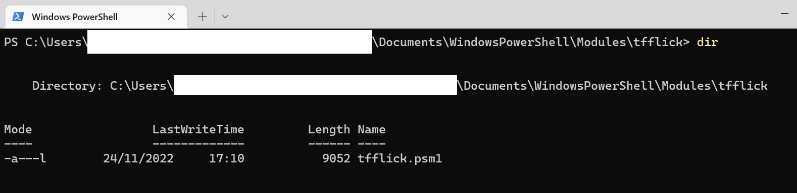
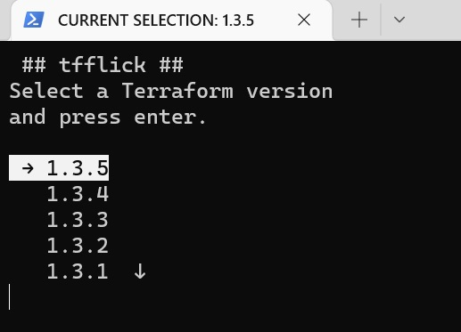
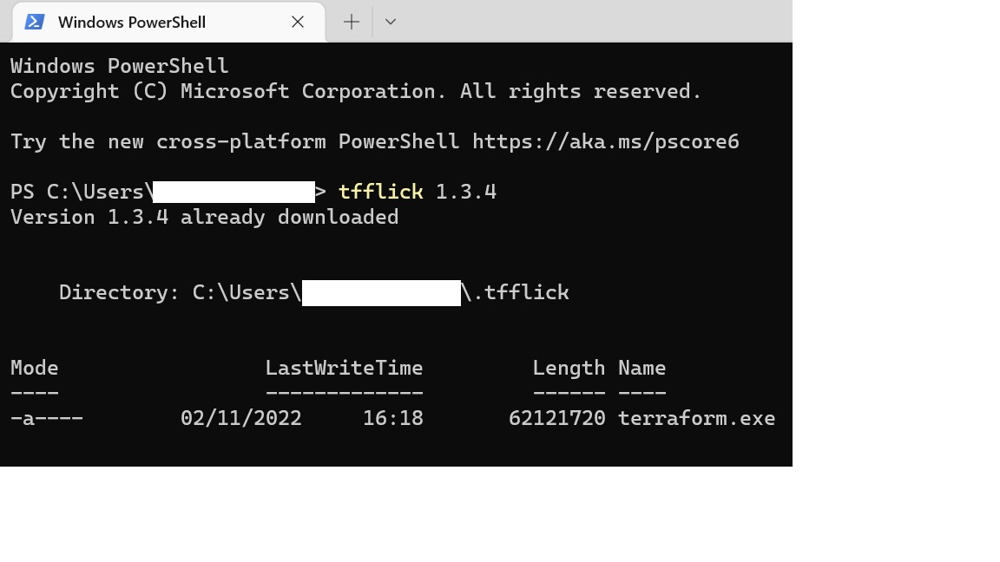
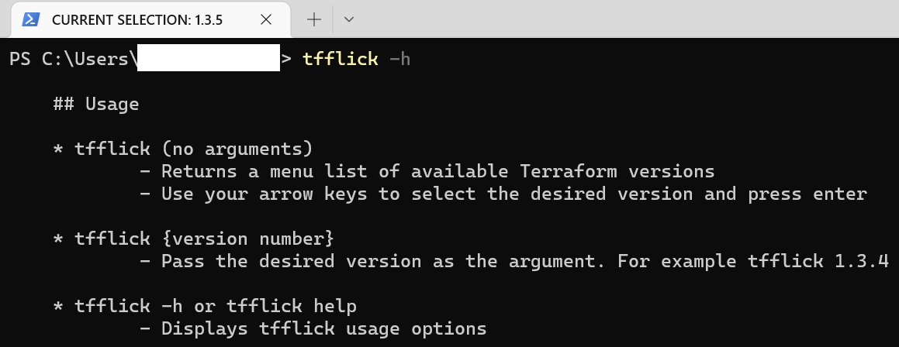

# tfflick

## Description

**tfflick** is a Powershell Terraform switcher module. **tfflick** downloads the specific version you require and switches between them.

**tfflick** is a Powershell alternative for tfswitch Terraform version manager.

Installation is quick and and you can start using Terraform straight away.

Terraform executables are downloaded from https://releases.hashicorp.com/terraform/ using **Tls12** protocol

**tfflick** Currently has been tested on Powershell version 5.1 and currently only downloads the Windows AMD64 versions of the Terraform executable

## Download

* In Powershell run this command replacing the path to your downloads directory and extract the contents of the zip file.
  `Invoke-WebRequest -URI https://github.com/ggaacode/tfflick/archive/refs/tags/v0.1.1.zip -OutFile <Downloads Directory>tfflick.zip`

* Direct download link https://github.com/ggaacode/tfflick/archive/refs/tags/v0.1.1.zip

## Installation

### Using the installer

Note, you'll need to check your Powershell execution policy before you can run the installer **install_tfflick.ps1** and use **tfflick** in general.

* As Administrator, run `Get-ExecutionPolicy -List` to get your current execution policy.
  You should see something like this:
```  
        Scope ExecutionPolicy
        ----- ---------------
MachinePolicy       Undefined
   UserPolicy       Undefined
      Process       Undefined
  CurrentUser       Undefined
 LocalMachine    RemoteSigned
```

* Ideally LocalMachine should be set to at least **RemoteSigned** and the **tfflick.psm1** module file is unblocked by running the `Unblock-File` command.   

  **Unrestricted** or **Bypass** would not require the file to be unblocked.

* Changing the execution policy. As Administrator, run `Set-ExecutionPolicy RemoteSigned -Scope LocalMachine`

* Unblocking **tfflick**

  The installation script can unblock the **tfflick.psm1** module script by passing the `unblock-tfflick` argument as administrator. See below for details.

  If you don't unblock the module, Powershell will prompt you and ask if you want the file to be unblocked and give you the exact command to run the first time you run **tfflick**.

  For example `Unblock-File -Path 'C:\**home directory**\Documents\WindowsPowerShell\Modules\tfflick\tfflick.psm1'` to run as Administrator.

* For more information about Powershell execution policies, see https://learn.microsoft.com/en-us/powershell/module/microsoft.powershell.core/about/about_execution_policies?view=powershell-5.1

## Run the Installer

Open Poweshell as Administrator and navigate to the extracted **tfflick** downloaded directory.

To run the installer when the execution policy is set to **LocalMachine RemoteSigned**, you need to temporarily set it to **Process Bypass** to be able to install **tfflick**. This is only valid for the current session of Powershell.

Run `Set-ExecutionPolicy Bypass -Scope Process`

Run `.\install_tfflick.ps1` if you don't want the module to be unblocked by the installer

Or `.\install_tfflick.ps1 unblock-tfflick` to unblock the module during installation

* The installer will copy the module to the C:\\**home directory**\Documents\WindowsPowerShell\Modules directory

* Create an entry in the User `PATH` for the **tfflick** working directory.

* Create the **tfflick** working directory in C:\\**home directory**\ called `.tfflick`.
  This directory contains the Terraform executable and downloaded version.

* Optionally unblock the **tfflick** module

### Manual installation

* Copy the module to the C:\\**home directory**\Documents\WindowsPowerShell\Modules directory
  Run `$env:PSModulePath -split ";"` to view all available Powershell module paths.
  Copy the **tfflick** directory and contents to the the Powershell module directory found above.

  

* Create the **tfflick** working directory in C:\\**home directory**\ called `.tfflick`

* Create an entry in the User `PATH` to the `tfflick` work directory created in the previous step.

### Removal

* Currently only manual removal is possible. Undo all steps in Manual installation.

## Usage

 `tfflick`
* Returns a menu list of available Terraform versions
* Use your arrow keys to select the desired version and press enter



 `tfflick {version number}`
* Pass desired version as the argument. For example `tfflick 1.3.4`



 `tfflick -h` or `tfflick help`
* Displays `tfflick` usage options



## Git Bash

You can use a limited version of `tfflick` in **Git Bash**. It allows to download and change **Terraform** versions by calling `tfflick {version number}` or `tfflick -h` or `tfflick help`. 
The scrolling menu is not available in **Git Bash**

**Procedure**

In **Git Bash**, append this code to your `~/.bash_profile` file. If the file doesn't exist, you can create it.

`vim ~/.bash_profile`

Paste/append this code in .bashrc

```
function tfflick(){
        if [ -z "$1" ]
        then
                echo "Please pass the desired Terraform version number as an argument"
                echo "Example: tfflick 1.3.5"
                echo "Alternatively use tfflick in a Powershell window"
        else
                powershell -command tfflick "$1"
                echo "tfflick has limited functionality in Git Bash."
                echo "To use the full version of tfflick try it in a Powershell window"
        fi
}
```

Then run: 

`source .bash_profile`

## Release Notes

## v0.1.1

* Added instruction for Git Bash usage
* Updated README description

## v0.1.0

* Initial release of **tfflick** module

## Known Issues

* The **Terraform** executable path can clash with pre-existing paths. 
  For example, if **Chocolatey** has previously used to install **Terraform** you might only see this version when running the **Terraform** executable.

  A workaround is to go to **Chocolatey's** bin directory and delete the **terraform** executable. Typically located at `C:\ProgramData\chocolatey\bin`

## To-Do

* Currently working on improving the menu option - The no argument option of **tfflick**.  
* Make available for Windows 32 bit architecture - availability to download the 32 bit version of the Terraform executable
* Provide Un-installer option
* Add features like recent Terraform versions used and download multiple versions
*owershell is supported across platforms, make **tfflick** platform aware so it can be used more widely.
* Tidy up
