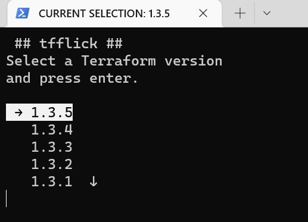

## Usage

 `tfflick`
* Returns a menu list of available Terraform versions
* Use your arrow keys to select the desired version and press enter

 `tfflick {version number}`
* Pass desired version as the argument. For example `tfflick 1.3.4`

 `tfflick -h` or `tfflick help`
* Displays `tfflick` usage options

